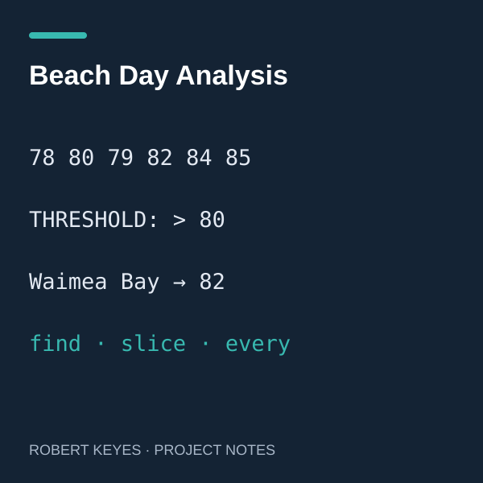

## Questions about a small dataset

In this practice exercise, I worked with six sample beach observations. Each record contains a beach name, wave height, and temperature. The functions search for a named beach, select the remaining observations from an index, and check whether temperatures stay above a threshold. The dataset is an example for learning TypeScript, not a live forecast or a recommendation about swimming conditions.

## My contribution

I brought my TypeScript implementation for debugging, including the record type and functions built around `find`, `slice`, and `every`. AI assistance identified a misplaced parenthesis in a function signature and a capitalization mismatch between `beachdays` and `beachDays`. The central logic was already in my submitted code. One of the more interesting functions finds the first observation from which every remaining temperature exceeds a chosen value.

## What the exercise taught me

This exercise helped connect array methods to specific questions: `find` chooses a candidate, `slice` selects the remaining records, and `every` checks the entire selected group. For the sample temperatures 78, 80, 79, 82, 84, and 85, the first point after which all temperatures exceed 80 is Waimea Bay at 82. It also reinforced that a correct idea can still fail because of small syntax or naming mistakes.

## Example from the exercise

```typescript
function temperatureBreakthrough(
  data: BeachDay[], minimumTemperature: number
): BeachDay | undefined {
  return data.find((day, index, arr) =>
    day.temperature > minimumTemperature &&
    arr.slice(index).every(currentDay =>
      currentDay.temperature > minimumTemperature)
  );
}
```

*AI assisted with debugging and this write-up. The illustration depicts the sample data.*
