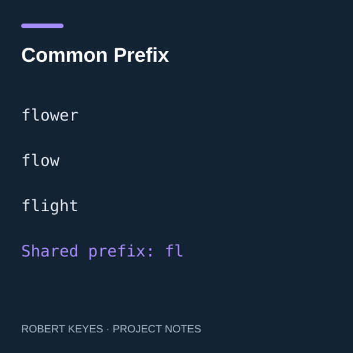

## Comparing strings by position

This exercise asks for the longest beginning shared by every string in an array. For example, `flower`, `flow`, and `flight` share `fl`; `dog`, `racecar`, and `car` share no prefix. I worked through the problem in TypeScript using nested loops rather than relying on a compact expression that would hide the comparisons.

## My approach

I began with the idea of collecting matching characters and asked for a guided walkthrough rather than a finished answer. Through that process, I wrote a function with one loop over character positions and another over the remaining strings. A mismatch returns the prefix immediately. Only after all strings match at a position does the function append that character. AI guidance helped me work out the loop structure and placement of the return statements.

## What I learned

The main lesson was separating two indexes: one chooses the string, and the other chooses a character within it. Tracing `flower`, `flow`, and `flight` made the control flow concrete: `f` matches, then `l` matches, then `o` differs from `i`, so the result is `fl`. The exercise also showed how early returns stop unnecessary work and why a character must be appended only after the inner loop finishes. This version follows the original problem's requirement that the array contains at least one string.

## My completed exercise

```typescript
function longestCommonPrefix(strs: string[]): string {
  let prefix = "";
  for (let charIndex = 0; charIndex < strs[0].length; charIndex++) {
    const currentChar = strs[0][charIndex];
    for (let stringIndex = 1; stringIndex < strs.length; stringIndex++) {
      const nextChar = strs[stringIndex][charIndex];
      if (nextChar !== currentChar) return prefix;
    }
    prefix += currentChar;
  }
  return prefix;
}
```

*AI provided step-by-step guidance and helped prepare this write-up and illustration. This is a learning exercise, not a standalone application.*
