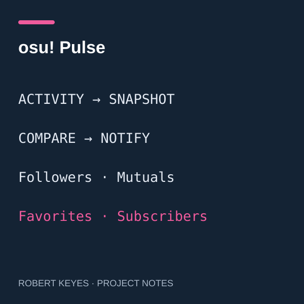

## Bringing activity changes into view

osu! Pulse is a Firefox and Zen Browser extension project that tracks changes in osu! followers, mutual connections, beatmap favorites, and mapping subscribers. Its documented design places updates inside the site's notification bell. The first successful check establishes a baseline, and later checks compare new information with that saved state. This is a personal prototype, not an official osu! product.

Learn more about the game on the [official osu! website](https://osu.ppy.sh/).

## My role and the implementation

I pursued this project as a way to connect my interest in gaming with a practical software tool. I used AI assistance to create the implementation; I do not claim to have independently written all of its code. The repository includes an extension package and a source archive. Its documentation describes OAuth authentication, periodic API requests, local snapshots, and a content script that integrates notifications into the website.

## Engineering lessons

The project illustrates why a notification feature involves more than displaying a message. It needs a baseline to distinguish old information from new changes, local state to preserve history, and controlled request timing to avoid excessive polling. The documented design uses backoff and spaces out requests. Website integration also creates a maintenance challenge because changes to osu!'s interface can affect the extension. These are useful areas for me to study further as I learn how to evaluate and maintain AI-assisted software.

The source repository is currently private. The package is documented as an unsigned local build, so this page does not claim a public release or independently verified production reliability.

*The image is a conceptual illustration, not a screenshot. AI assisted with the extension and this portfolio write-up.*
